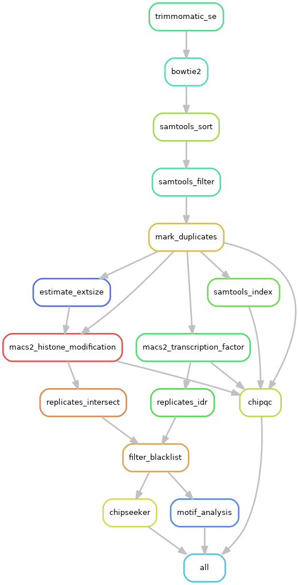

# ChIP-seq

A snakemake based pipeline for ChIP-seq analysis.

For details about the pipeline, please see [details](details.md).



## Getting Started

### Installation

1. clone this repository

```
git clone https://github.com/xizhihui/pipelines/ChIP-seq.git
cd ChIP-seq
```


2. install Snakemake

First of all, we need to install the snakemake in a conda environment.

```bash
conda create -n snakemake --file envs/snakemake.yaml
source activate snakemake
```

3. install hommer

There are so large database files to download when using hommer to do the motif analysis, and it's recommnad to download in advance. In the script below, `{species_assembly} ` should be replaced depending your own experiment, choices can be "hg19", "hg38", "mm10", "mm9", and so on. **Command `export PATH=$PATH:$(pwd)\/homer\/bin\/` can put into the `.\/bashrc` file with the absolute path to "homer\/bin", or you should excute this command every time after you logout and log in.**

```bash
mkdir homer &&  cd homer
wget http://homer.salk.edu/homer/configureHomer.pl 
perl configureHomer.pl -install
perl configureHomer.pl -install {species_assembly}
export PATH=$PATH:$(pwd)/homer/bin/
cd ..
```

### Configuration

> Column "sample" of samples.tsv, mocks.tsv, units.tsv must be the same order.

1. units.tsv

`units.tsv` tells the pipeline the positions of raw fastq files and the replicates of samples. For example, if your data is single end, the you just give `fq1` column and for paired end, `fq2` should be provided. If your smaple like control with two replicates, then use "rep1", "rep2" in `unit` column. Example below, both control and H2Aub1 have two replicates, Ring1B has three.

```
sample	unit	fq1	fq2
Control	rep1	rawdata/Control_MockIP_rep1.fastq.gz
Control	rep2	rawdata/Control_MockIP_rep2.fastq.gz
H2Aub1	rep1	rawdata/H2Aub1_rep1.fastq.gz
H2Aub1	rep2	rawdata/H2Aub1_rep2.fastq.gz
H3K36me3	rep1	rawdata/H3K36me3_rep1.fastq.gz
H3K36me3	rep2	rawdata/H3K36me3_rep2.fastq.gz
Ring1B	rep1	rawdata/Ring1B_rep1.fastq.gz
Ring1B	rep2	rawdata/Ring1B_rep2.fastq.gz
Ring1B	rep3	rawdata/Ring1B_rep3.fastq.gz
```

2. mocks.tsv

`mocks.tsv` is used to identify the Input sample and Treat sample in a ChIP experiment. In the example, control sample is the Input, and H2Aub1 and Ring1B are the Treat. The value of column "type" can be "tf" or "hm", which means "transcription factor" and "histone modification".

```
sample	unit	mock_sample	mock_unit	type
H2Aub1	rep1	Control_MockIP	rep1	tf
H2Aub1	rep2	Control_MockIP	rep2	tf
H3K36me3	rep1	Control_MockIP	rep1	hm
H3K36me3	rep2	Control_MockIP	rep2	hm
Ring1B	rep1	Control_MockIP	rep1	tf
Ring1B	rep2	Control_MockIP	rep2	tf
```

3. samples.tsv

`samples.tsv` is used for the differential analysis.

```
sample	group
Control	control
Control	control
H2Aub1	H2Aub1
H2Aub1	H2Aub1
H3K36me3	H3K36me3
H3K36me3	H3K36me3
```

4. config.yaml

`config.yaml` is the main configuration for the scripts.

	+ email: a email address to inform yourself when pipeline is completed or interrupted
	+ ref: the references used in mapping or peak calling
	+ MACS2: params only for macs2, blacklist is provided here

### Run the pipeline

1. Testing

To begin with the pipeline, use the "dryrun" to test whether it works well.

```bash
snakemake -n
```

2. Prepare conda environment

This step is optional but recommended, because packages' downloading is always time consuming.

```bash
snakemake --use-conda --create-envs-only
```

3. Analysis
```bash
nohup snakemake --use-conda --cores 10 &
```

### File tree

```
.
├── Snakefile
├── units.tsv
├── config.yaml
├── mocks.tsv
├── samples.tsv
├── dag.pdf
├── envs
│   ├── bedtools.yaml
│   ├── callpeak.yaml
│   ├── chipseeker_clusterprofiler.yaml
│   ├── idr.yaml
│   └── phamtompeaktools.yaml
├── homer
├── logs
│   ├── annotation
│   ├── callpeak
│   ├── mapping
│   ├── motif
│   ├── qc
│   └── trim
├── output
│   ├── annotation
│   ├── callpeak
│   ├── mapping
│   ├── motif
│   ├── qc
│   └── trim
├── rawdata
│   ├── Control_MockIP_rep1.fastq.gz
│   ├── Control_MockIP_rep2.fastq.gz
│   ├── download.sh
│   ├── H2Aub1_rep1.fastq.gz
│   ├── H2Aub1_rep2.fastq.gz
│   ├── H3K36me3_rep1.fastq.gz
│   ├── H3K36me3_rep2.fastq.gz
│   ├── PRJNA156325.txt
│   ├── reference
│   ├── Ring1B_rep1.fastq.gz
│   ├── Ring1B_rep2.fastq.gz
│   ├── Ring1B_rep3.fastq.gz
├── rules
│   ├── alignment.smk
│   ├── annotation.smk
│   ├── callpeak.smk
│   ├── common.smk
│   ├── download.smk
│   ├── downstream.smk
│   ├── preprocess.smk
│   ├── report.smk
│   └── subsample.smk
├── schemas
│   ├── config.yaml
│   ├── mocks.yaml
│   ├── samples.yaml
│   └── units.yaml
└── scripts
    ├── callpeak.py
    ├── chipqc.R
    ├── chipseeker.R
    ├── idr.py
    └── run_spp.R
```

## Reference

* [snakemake](https://snakemake.readthedocs.io/en/stable/index.html)
* [hbctraining](https://github.com/hbctraining/In-depth-NGS-Data-Analysis-Course/)
* [crazyhotommy](https://github.com/crazyhottommy/ChIP-seq-analysis/blob/master/part0_quality_control.md#encode-guidlines)
* [chilin](http://cistrome.org/chilin/_downloads/instructions.pdf)
* [ENCODE](http://www.ncbi.nlm.nih.gov/pubmed/22955991)
* [Phantompeakqualtools](https://github.com/kundajelab/phantompeakqualtools)
* [Irreproducibility Discovery Rate](https://github.com/nboley/idr)
* [生信技能树](https://www.jianshu.com/p/1384173c353b)